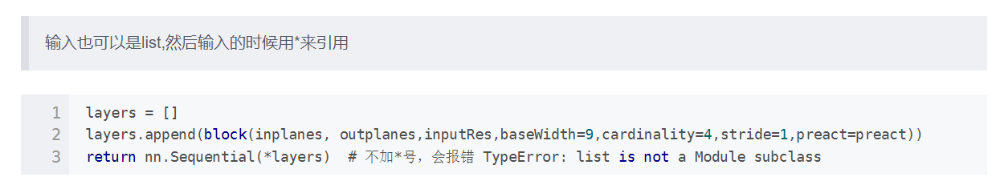

# ViT model
## Summarize
ViT的网络结构很好地保留了Transformer的encoder架构，主要是在输入图片上下功夫
使得输入图片能够变成输入序列 且复杂度不高\
原论文中ViT需要在很大的数据集上预训练之后在下游任务上微调才能取得或者超过传统卷积网络的性能\
但不可否认的是，ViT确实打破了NLP与CV之间的壁垒，使得多模态任务仅用简单的模型成为可能，同时也埋下了很多新坑\
如何在中小型数据集上从头训练也能够发挥不错的性能等（目前已有相关研究）
## 代码实现细节上
- 将QKV并在一起进行线性变换 提高并行度 加快训练速度
- 图片分patches 利用大小和patch大小一样 步距为patch的卷积核来切割图片成1D的向量
- 参考Bert加入观察全局的cls token（其实用GAP来实现也行）
- Position Embedding 采用1d(2d或者相对位置编码都一样)
## Some Problems
如下图所示，在使用nn.Sequential时 可以用*layers

## Reference
- [rwightman](https://github.com/rwightman/pytorch-image-models/blob/master/timm/models/vision_transformer.py#L366)
- [WZIMIAOMIAO](https://github.com/WZMIAOMIAO/deep-learning-for-image-processing/blob/master/pytorch_classification/vision_transformer/vit_model.py)